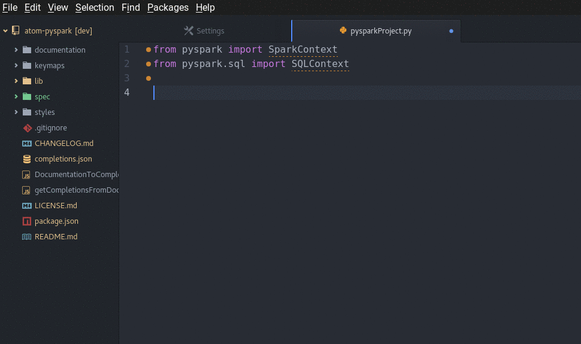

# atom-pyspark package
### v0.2.1

An Atom package adding auto-completions, documentation, snippets and tools to develop in PySpark (Apache Spark with Python Api)
Uses the
[autocomplete-plus](https://github.com/atom-community/autocomplete-plus) package.

Auto-completions and documentations are powered by PySpark official documentation here:
[PySpark Api Documentaion](http://spark.apache.org/docs/latest/api/python/)

For now, only pyspark and pyspark.sql are available in this package. Other subpackages (ml, mllib, streaming) will be added soon.
